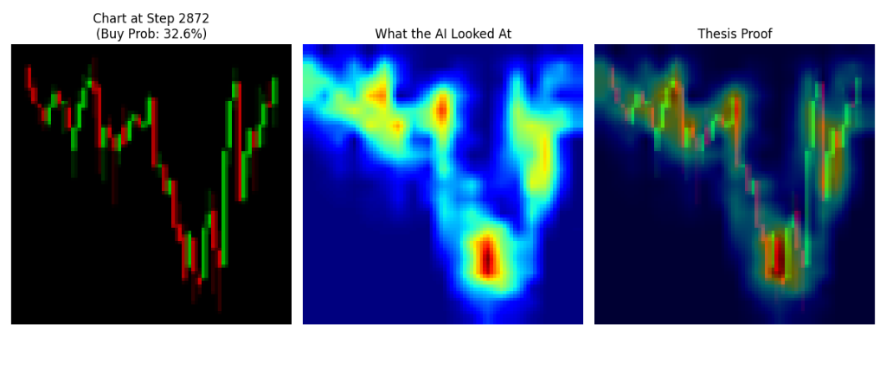

# End-to-End Visual Reinforcement Learning for Chart Pattern Recognition

[](https://www.python.org/downloads/)
[](https://gymnasium.farama.org/)
[](https://stable-baselines3.readthedocs.io/)
[](https://pytorch.org/)

An advanced trading system that teaches an AI agent to "see" and trade chart patterns using Convolutional Neural Networks (CNNs) and Reinforcement Learning (RL). Unlike traditional bots that use raw numerical data, this agent makes decisions based on visual candlestick formations, mimicking a human trader's pattern recognition.

---

## 🚀 Key Features

- **Visual Perception**: Converts raw price data into high-contrast "Robot Vision" candlestick charts.
- **Pre-trained Vision (Autoencoder)**: Uses a Conv2D Autoencoder to learn compact latent representations of market structures.
- **Deep RL (PPO)**: Implements Proximal Policy Optimization (PPO) via Stable Baselines3 for robust strategy learning.
- **Explainable AI (Grad-CAM)**: Visualizes the agent's attention using Heatmaps to show exactly which price patterns triggered a trade.
- **High-Performance Rendering**: Pre-renders and caches chart images to maximize training speed.

---

## 🛠 Project Architecture

The project is structured into four distinct phases:

1.  **Phase 1: Renderer (`chart_renderer.py`)** - Fetches data via `yfinance` and renders clean `84x84` RGB images using `mplfinance`.
2.  **Phase 2: Autoencoder (`autoencoder.py`)** - Trains an unsupervised model to compress visual charts into meaningful feature vectors.
3.  **Phase 3: Environment (`visual_trading_env.py`)** - A custom Gymnasium environment that handles portfolio logic, trading fees, and visual states.
4.  **Phase 4: RL Agent (`train_agent.py`)** - Integrates the pre-trained vision encoder with a PPO agent to learn trading strategies.
5.  **Phase 5: Explainability (`explain_agent.py`)** - Uses Grad-CAM to generate attention overlays for thesis and validation.

---

## 📦 Installation

```bash
# Clone the repository
git clone https://github.com/utkarsh/End-to-End-Visual-Reinforcement-Learning-for-Chart-Pattern-Recognition.git
cd End-to-End-Visual-Reinforcement-Learning-for-Chart-Pattern-Recognition

# Install dependencies
pip install gymnasium stable-baselines3 torch yfinance mplfinance pandas numpy matplotlib opencv-python tqdm pillow
```

---

## 🚦 Usage Guide

### 1. Data Preparation
Pre-render the charts to disk for maximum training efficiency.
```bash
python pre_render.py
```

### 2. Train the Vision Model (Optional)
This trains the "eyes" of the agent to understand chart geometry.
```bash
python autoencoder.py
```

### 3. Train the Trading Agent
Learns a trading strategy using the pre-trained vision weights.
```bash
python train_agent.py
```

### 4. Explain the AI's Logic
Generate a Grad-CAM heatmap to see what the AI is looking at.
```bash
python explain_agent.py
# Or for the strongest signal:
python explain_best_effort.py
```

---

## 📊 Visual Proof (Grad-CAM)

The system includes tools to verify the "Pattern Recognition" claim. By using **Grad-CAM**, we can see if the AI is focusing on the relevant parts of the chart (e.g., support/resistance levels, double tops, or breakouts).



*(Note: This visualization is generated by `explain_best_effort.py` showing what the AI focuses on when evaluating a chart.)*

---

## 🛡 Disclaimer
This project is for educational/research purposes only. Trading financial markets involves significant risk. **Use this code at your own risk.**

---

## 🧪 Tech Stack
- **Core**: Python 3.9
- **RL Framework**: Stable Baselines3 (PPO)
- **Deep Learning**: PyTorch
- **Environment**: Gymnasium
- **Visualization**: Matplotlib, OpenCV, Mplfinance
- **Data Source**: Yahoo Finance (yfinance)